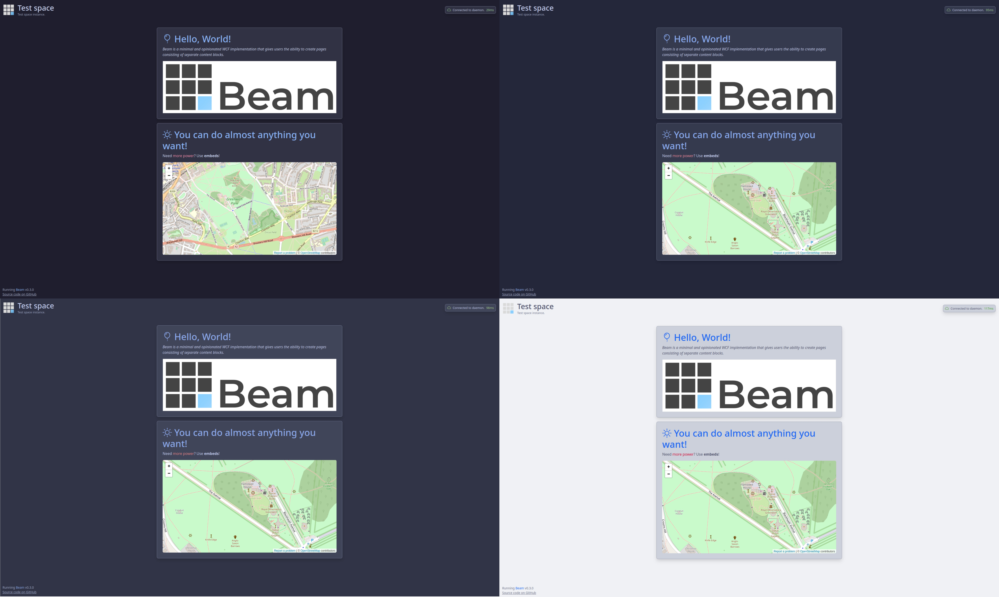

[](https://github.com/d1snin/beam)

[](https://github.com/d1snin/beam/actions/workflows/build.yml)
[](https://maven.d1s.dev/#/releases/dev/d1s/beam)

## Beam

Beam is a minimal and opinionated WCM implementation that gives users the ability to create pages consisting of separate
content blocks.
Beam can allow you to create a product page, a business card website, personal website or any other project in a second
that does not imply a high level of user interactions.

[](https://github.com/d1snin/beam)

### Get started with Beam

Beam documentation lives [here](https://beam.d1s.dev). It is powered by itself!

### Code of Conduct

Please refer to [CODE_OF_CONDUCT.md](./CODE_OF_CONDUCT.md).

### License

```
Copyright 2023 Mikhail Titov <me@d1s.dev>

Licensed under the Apache License, Version 2.0 (the "License");
you may not use this file except in compliance with the License.
You may obtain a copy of the License at

    https://www.apache.org/licenses/LICENSE-2.0

Unless required by applicable law or agreed to in writing, software
distributed under the License is distributed on an "AS IS" BASIS,
WITHOUT WARRANTIES OR CONDITIONS OF ANY KIND, either express or implied.
See the License for the specific language governing permissions and
limitations under the License.
```